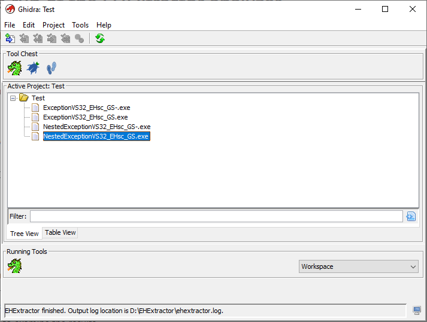
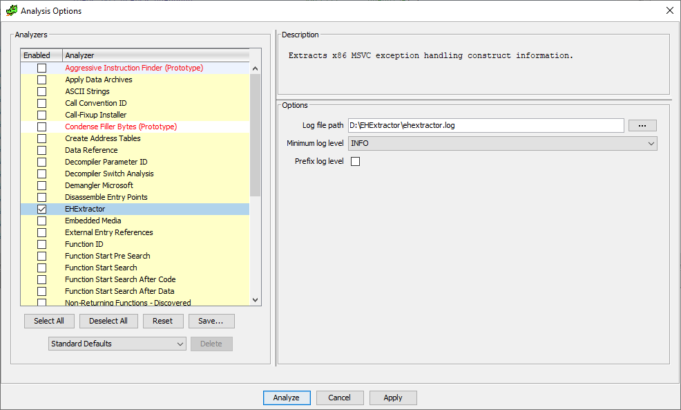

# EHExtractor for Ghidra

EHExtractor offers both an analyzer and a script for the reverse engineering framework [Ghidra](https://ghidra-sre.org/), that extract exception handling (EH) information from x86 binaries produced by the Microsoft Visual C++ compiler.

It was created as part of a research effort to improve the decompilation of C++ code at the *Open Universiteit* in the Netherlands.

The main contributor is [Remco Slijkhuis](https://github.com/RemcoSlijkhuis).

## Features

* Produces an overview of the try/catch block layout for each function with such constructs.
* The overview contains all information that can be determined from the underlying EH data structures, including state values of try and catch blocks, catch block addresses and catch block exception types.
* The overview can be output to a file (analyzer, script) and to the Ghidra console (script).

The following is an example of the output EHExtractor produces for a function with nested try and catch blocks.

```
Looking at: FUN_00401980
Memory range: 00401980-004019f7
Normal start instructions found.
Exception handling start instructions found.
EH handler registration instructions found.
Determined ehFuncInfoAddress: 00404d60
Try/catch block overview:
/* TryBlockMapEntry [5]	1-5,12,1 */
Try (state=1) {
  /* TryBlockMapEntry [1]	2-4,5,1 */
  Try (state=2) {
    /* TryBlockMapEntry [0]	3-3,4,1 */
    Try (state=3) {}
    Catch (std::logic_error) (state=4)	@0x004019f8 {}
  }
  Catch (CustomException1) (state=5)	@0x00401a19 {}
}
Catch (...) (state=6)	@0x00401a3d {
  /* TryBlockMapEntry [4]	7-7,12,2 */
  Try (state=7) {}
  Catch (std::out_of_range) (state=8)	@0x00401a4f {}
  Catch (...) (state=8)	@0x00401a82 {}
  ToBeNestedInCatches {
    /* TryBlockMapEntry [3]	11-11,12,1 */
    Try (state=11) {}
    Catch (...) (state=12)	@0x00401a92 {}
    /* TryBlockMapEntry [2]	9-9,10,1 */
    Try (state=9) {}
    Catch (...) (state=10)	@0x00401a5f {}
  }
}
```

## Installation instructions and requirements

The current version of the packaged analyzer was written and tested using Ghidra version [10.2.2](https://github.com/NationalSecurityAgency/ghidra/releases/tag/Ghidra_10.2.2_build) and it is recommended to use this same Ghidra version.

#### Analyzer

- Download the ghidra*.zip file from the ["dist"](/dist) directory.
- Start Ghidra.
- From the Project window, click File/Install Extensions...
- Click the + icon (top right) and navigate to the location of the ghidra*.zip file. Select the file and click OK.
- After installation, click OK and restart Ghidra.

#### Script

Running the script requires not only a working installation of Ghidra, but also of Eclipse and the GhidraDev plugin which provides a bridge between Ghidra and Eclipse.

- Install Eclipse (https://eclipseide.org/).
- Install GhidraDev by following the instructions in the [Ghidra installation guide](https://ghidra-sre.org/InstallationGuide.html#Development).
- Use GhidraDev in Eclipse to create a new Ghidra Module Project.
- Copy the contents of the EHExtractor repository over the project folder.


## Usage

Instructions for using EHExtractor are listed below. Test binaries and corresponding output log files can be found in the ["data/Test_and_log_files"](/data/Test_and_log_files) folder together with a [step-by-step example](/data/Test_and_log_files/README.md) of running the analyzer.

#### Analyzer

- Start Ghidra and open the binary you want to analyze.
- If the binary has not been analyzed before with the standard set of analyzers (or previous results were not saved):
	- Select Analysis/Auto Analyze from the menu.
	- Run the standard set of analyzers on it.
- Do a single or one-shot run of the "Shared Return Calls" analyzer. This analyzer is part of the standard set of analyzers but was found to miss some crucial aspects of the binary when run together with the other analyzers.
- Select Analysis/Auto Analyze from the menu.
- Select "EHExtractor" and enabled it if not yet enabled. (Note: If the opened binary is not an x86 MSVC-compiled binary, the analyzer will not be listed.)
- Adjust the location of the output file, the minimum logging level, and whether or not to prefix the output lines with the log level to your liking. (See the [options](#options) section for an explanation of the possible values.)
- Click Analyze. The analyzer output will be written to the log file.
- While running, EHExtractor will give a few updates in the Project window (such as starting, working, finished). The output log file path is included in the start and finish messages. These can also be seen in Ghidra's application log.

<br>
The Ghidra project window with an 'EHExtractor finished' message.


#### Script
- Adjust  the location of the output file, the minimum logging level, and  whether or not to prefix the output lines with the log level in the script file in Eclipse to your liking<sup>1</sup>. (See the [options](#options) section for an explanation of the possible values.)
- Open the Ghidra Module Project in Eclipse and go to the ghidra_scripts folder.
- Select EHExtractor.java and then "Run As Ghidra"; this will start up Ghidra and do the necessary setup to connect the project to Ghidra.
- Select the binary you wish to analyze. Ghidra will now open completely
- If the binary has not been analyzed before (or previous results were not saved):
	- Select Analysis/Auto Analyze from the menu.
	- Run the standard set of analyzers on it.
- Optionally, do a single or one-shot run of the "Shared Return Calls" analyzer. This analyzer is part of the standard set of analyzers but was found to miss some crucial aspects of the binary when run together with the other analyzers<sup>2</sup>.
- Go to the Script Manager (Window/Script Manager) and open the folder "C++".
- Run "EHExtractorScript.java" by double-clicking on it or selecting it and clicking the green play button. The analyzer output will be written to the log file and to the Ghidra console.

<sup>1 The options can be changed in Eclipse without having to restart Ghidra; the changed settings will be used the next time the script is run.</sup><br>
<sup>2 Unlike the analyzer version of EHExtractor, the script version will also execute the "Shared Return Calls" functionality.</sup>

## Options

<br>
The EHExtractor analyzer options screen in Ghidra.

Description of the options:
- Log file path: The path to the log file. If the file already exists, new output will be appended to it. Defaults to an ehextractor.log file in the user's Documents directory (on Windows).
- Minimum log level: INFO is the default value and intended for everyday use. Anything lower than INFO (FINE and FINER) will give increasingly more output details (useful for debugging).
- Prefix log level: Whether or not to prefix the output lines with the log level. Default: not checked.

## Code structure and documentation

The main directory layout of this repository is that of a Ghidra Module Project as created by the GhidraDev plugin. The contents of the various high-level directories are as follows:

| Directory          | Contents                                                                                                                                  |
| ------------------ | ----------------------------------------------------------------------------------------------------------------------------------------- |
| data               | Images used in the READMEs, and test and log file examples.                                                                               |
| dist               | Packaged version of the analyzer.                                                                                                         |
| doc                | Package and class documentation in the form of rendered javadoc.                                                                          |
| ghidra_scripts     | Code specific to the Ghidra script version of EHExtractor: EHExtractorScript.java and the package loggingbridge.                          |
| src/main/java      | Contains the main code. The code is grouped into the packages ehextractor, instructionpattrns, msvc.exceptions, and msvc.exceptions.code. |
| src/test/java      | Unit tests for classes in package msvc.exceptions.                                                                                        |
| src/test/resources | Input and result files used in the unit tests.                                                                                            |

An overview of the packages and the classes contained therein is given below. All class files have also been provided with javadoc.

### Package ehextractor

Contains the analyzer version of EHExtractor, as well as high-level classes for finding functions, starting the analysis, logging, and checking if a binary can be handled by EHExtractor.

Classes:
- **EHExtractorAnalyzer**: The analyzer version of EHExtractor. Uses `ProgramValidator` for initial validation checks, sets up logging using `Logging`, initializes and starts `EHExtractor` (the highest-level class responsible for extracting MSVC exception handling information).

- **EHExtractor**: Highest-level class responsible for extracting MSVC exception handling information from a program. Called from both the analyzer and the script.
Uses `FunctionUtils` to find the functions to analyze, starts the analysis, and uses `EHHandler` and `Prologue` from the msvc.exceptions.code package to retrieve certain specific addresses as part of the analysis, and `MSVCEHInfo` in package msvc.exceptions to parse the MSVC EH data structures.

- **FunctionUtils**: Utility class for finding functions within a given program using the Ghidra API.
- **Logging**: Responsible for setting up and managing logging for EHExtractor (both analyzer and script versions). Registers a Logger singleton for easy access to logging functionality in any part of EHExtractor.
- **ProgramValidator**: Provides methods to validate if a program can be analyzed by EHExtractor.

- **SharedReturnCalls**: Provides an alternative way to 'run' the "Shared Return Calls" analyzer, which is crucial for resolving calls to thunked functions, such as CxxFrameHandler3. Currently only called by `EHExtractorScript`.


### Package msvc.exceptions.code

Helper classes for finding function prologues matching how MSVC creates these when exception handling (EH) is in play, and for matching code that registers the MSVC EH entry data structure (with optional security cookie-checking code before that).

Classes:
- **EHHandler**: Class for looking for exception handling setup code and extracting FuncInfo addresses.
- **Prologue**: Represents the start (prologue) of a function; analyzes the prologue of functions to identify and extract addresses related to exception handling setup as done by MSVC.

Both `EHHandler` and `Prologue` use classes from the instructionpattrns package to look for specific instructions.


### Package instructionpattrns

Contains classes for instruction patterns as implemented by EHExtractor, providing functionality for matching instruction patterns with actual instructions.

(Note that the package name 'instructionpattrns' is not a typo. After introduction of the term 'instruction patterns' for this functionality in EHExtractor it was found that Ghidra had something called 'instruction patterns' as well. Calling the EHExtractor package 'instructionpatterns' caused many problems and the package name was set to 'instructionpattrns' for the time being.)
 
Classes:
- **InstructionPattern** (abstract): Abstract base class for instruction patterns, with scaffolding for matching with an actual instruction.

- **AddressInstructionPattern** (concrete): For matching instructions that involve addresses, using either direct or indirect addressing modes.
- **NopInstructionPattern** (concrete): For matching NOP instructions.
- **RegisterInstructionPattern** (concrete): For matching instructions that involve registers.
- **ScalarInstructionPattern** (concrete): For matching instructions that involve scalar non-address values.

- **InstructionPatterns**: Facilitates matching a list of instruction patterns with a sequence of instructions.
- **MatchResult**: Represents the result of matching a sequence of instructions against a sequence of instruction patterns.


### Package msvc.exceptions

Contains classes related to the 32-bit exception handling data structures created by MSVC.

Core classes:
- **MSVCEHInfo**: Top-level representation of the exception handling information for individual functions in Microsoft Visual C++-compiled binaries that can be derived from the various EH-related data structures used.
- **TryBlockMapEntry**: Represents an entry in the MSVC TryBlockMap data structure, linking try and catch blocks.
- **TryBlock**: Represents a try block as implemented by MSVC.
- **CatchHandler**: Represents a catch block as implemented by MSVC.
- **UnwindMap**: Manages a map of unwind states, as stored by MSVC in its UnwindMap data structure.

`TryBlock` and `CatchHandler` both implement the `ITryCatch` interface and identify themselves as try or catch blocks through the `BlockType` enum.

This package also contains factory classes for creating `MSVCEHInfo`, `TryBlockMapEntry`, `CatchHandler` and `UnwindMap` instances, and the supporting classes `Range` and `TryLowComparator`.

Unit tests:
- Unit tests for the classes `MSVCEHInfo`, `TryBlockMapEntry`, `TryBlock`, `CatchHandler`, `Range` can be found in the directory src/test/java.
- `NestedStructureParser` is a support class used in the unit test class for `MSVCEHInfo`; it also has its own unit test.


### Default package

Contains the Ghidra script version of EHExtractor. This file must be in the default package for Ghidra to be able to use it.

Class:
- **EHExtractorScript**:  The script version of EHExtractor. Uses `ProgramValidator` for initial validation checks, sets up logging using `Logging`, initializes and starts `EHExtractor` (the highest-level class responsible for extracting MSVC exception handling information).


### Package loggingbridge (script-specific)

Contains a custom log handler that directs log output to the Ghidra script console.

Class:
- **GhidraScriptHandler**: Custom log handler that directs log output to the Ghidra script console.
